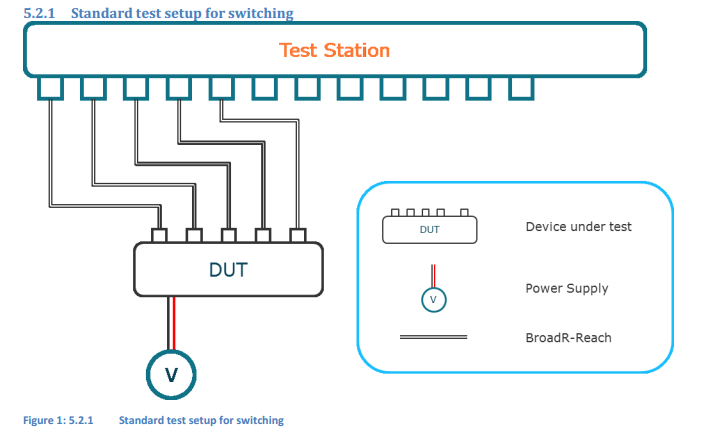
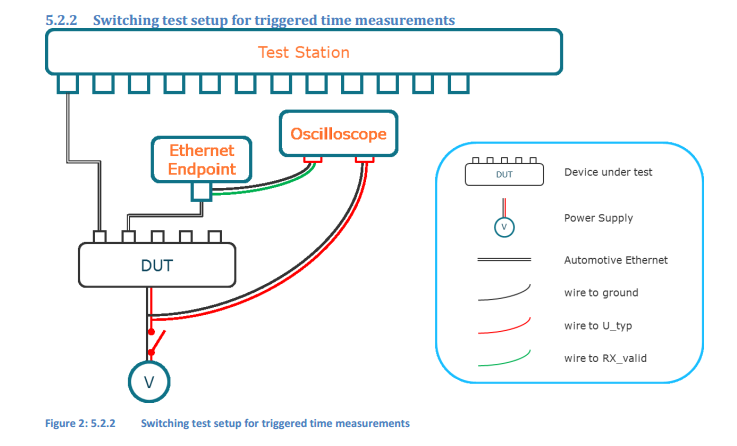

车载Ethernet Switch功能与性能测试文档中文版

# **目录**

[toc]

# TC8 测试流程 TC8 - ECU 和网络测试

# OPEN 联盟汽车以太网ECU测试规范第 2 层 - CN

> 草案 & 终版

| 作者&公司 | Thomas Kirchmeier (BMW AG) Georg Janker (Ruetz System Solutions GmbH) All Members of the OPEN ALLIANCE TC8 Working Group |
|:--|:--|
| **标题** | **OPEN 联盟汽车以太网 ECU 测试规范第 2 层** |
| **版本** | **3.0** |
| **日期** | **2019.10.25** |
| **现状** | **草案** |
| **限制级别** | **仅限 OPEN 技术会员** |

**文件版本控制**

版本|作者|描述|日期
:-|:-|--|--
**1.0**|**TC8 成员**|**首次发布**|2016.01.15
**1.1**|T.Kirchmeier (BMW)|关于 IPv4 测试用例的说明，参见变更历史|2016.05.31
**1.2**|T.Kirchmeier (BMW)|关于 UDP 测试用例的说明，参见变更历史|2016.06.29
1.3|T.Kirchmeier (BMW)| 关于 ICMPv4 测试用例的说明，参见变更历史 |2016.09.07
1.4|Mathias Kleinwächter (Ruetz System Solutions GmbH)|第 5.6 章 DHCPv4 服务器已删除|2017.05.19
1.4|Mathias Kleinwächter (Ruetz System Solutions GmbH)|关于 TCP 测试用例的说明，参见变更历史记录|2017.05.23
1.4|Mathias Kleinwächter (Ruetz System Solutions GmbH)|新增章节 6.1.4 SOMEIP 测试桩增强测试服务（ETS） 规范 6.1.6 测试用例 ETS 关于 ARP 测试用例的改进，参见变更历史记录|2017.05.24
1.4|Georg Janker|更新第 1 层和第 2 层章节|2017.05.24
1.5|Georg Janker|更新 SOME/IP 对 AUTOSAR 参考的版本至 1.1.0|2017.05.30
1.5|Georg Janker| 插入章节：3.6 TC11 参考测试 |2017.05.30
1.6|Mathias Kleinwächter (Ruetz System Solutions GmbH)|移除了端口禁用测试，并参考相应的 TC11 测试|2017.06.07
1.7|Mathias Kleinwächter (Ruetz System Solutions GmbH)| 已删除无效或重复的测试用例。参见变更历史 |2017.06.20
1.8|Frederic Garraud|更新 1.3 参考文件|2017.06.22
1.9|Mathias Kleinwächter (Ruetz System Solutions GmbH)|更新了 L2 交换的变更历史|2017.06.23
2.0|Mathias Kleinwächter (Ruetz System Solutions GmbH)|发布最终版本 2.0|2017.09.06
3.0|Mathias Kleinwächter (Ruetz System Solutions GmbH)|单独第 2 层文档的初始版本|2019.12.17

限制级别：OPEN 仅限技术成员 OPEN Alliance 汽车以太网 ECU 测试规范第 2 层 2019年10月

**文档的限制级别历史**

版本|限制级别|描述|日期
:-|:-|--|--
1|仅限 OPEN 技术会员|技术会员|2019.10.25

## 前言（免责声明）

OPEN联盟：仅限会员 / OPEN 内部规范

OPEN 联盟机密

版权声明和免责声明

其贡献被纳 入OPEN 规范的 OPEN 联盟成员（“贡献成员”）拥有 OPEN 规范的版权，并允许按以下方式使用本 OPEN 规范：

OPEN 联盟成员：OPEN 联盟的成员有权使用本开放规范，但须继续遵守 OPEN 联盟的管理文件、知识产权政策和适用的开放联盟发起人或授权人协议；非 OPEN 联盟成员：禁止非 OPEN 联盟成员的任何人使用本开放规范。

收到 OPEN 规范不得作为任何专利、工业设计、商标或其他权利的转让或许可，这些权利可能存在于任何 OPEN 规范中，或包含在任何开放规范中，或在任何 OPEN 规范中复制。本开放规范的实现将需要这样的许可证。

本公开规范按“原样”提供，除非法律强制规定，否则排除所有明示或暗示的保证。因此，开放联盟和参与成员不对公开规范或信息做出任何陈述或保证。（包括任何软件），包括对适销性、适用性、或不存在第三方权利，并且不对公开规范或其中包含的任何信息的准确性或完整性做出任何声明。

对于因使用或依赖 OPEN 规范或其中的任何信息而产生的任何损失、成本、费用或损害，OPEN 联盟和贡献成员概不负责。本文件中的任何内容均不限制或排除任何欺诈责任或任何其他法律不允许排除或限制的责任。

在不影响前述内容的情况下，OPEN 规范仅针对汽车应用开发。OPEN 规范尚未开发，也未针对非汽车应用进行测试。

OPEN 联盟保留随时撤回、修改或替换任何OPEN规范的权利，恕不另行通知。

## 简介

本 ECU 和网络测试规范旨在确定产品是否符合 OPEN 规范或相关要求中定义的规范。本规范是建议考虑用于汽车的所有测试用例的集合，汽车制造商应在其质量控制过程中参考。

成功执行并通过所有相关测试可使被测设备（DUT）获得最低限度的认可，即设备的基本实现正确完成。

本测试规范文档分为几个章节，分别针对以下范围：第1.3章中描述的 “汽车以太网”、“TCP/IP协议族” 和 “汽车协议”。测试通过与其范围相关的不同ID和唯一枚举进行组织和识别。对于每个范围，介绍章节解释了对受试设备的常见要求，测试设置和以下测试使用的参数

### 1. 范围（必填）

范围，汽车以太网包括以下 ISO/OSI 层：

- 以太网第2层：数据链路层，例如 IEEE 以太网 MAC + VLAN（802.1Q），APR

### 2. 规范性参考文件（强制性）

下列文件在文中引用时，其部分或全部内容构成本文件的要求。对于注日期的引用文件，仅引用的版本适用。对于未注日期的引用文件，引用文件的最新版本（包括任何修改）适用。

[1] OA_100BASE-T1 Interoperability Test Suite 1v0 / OA_100 BASE-T1 互操作性测试套件 1v0

[2] IEEE Std 802.3 $bw^{TM}$ – 2015 Amendment 1: Physical Layer Specifications and Management Parameters for 100 Mb/s Operation over a Single Balanced Twisted Pair Cable (100BASE-T1). / IEEE Std 802.3bwTM - 2015 修订1：通过单根平衡双绞线电缆（100 BASE-T1）进行100 Mb/s 操作的物理层规范和管理参数

[3] IEEE 100BASE-T1 Physical Media Attachment Test Suite Version 1.0 / IEEE 100 BASE-T1 物理介质附件测试套件版本 1.0

[4] IEEE 100BASE-T1 Definitions for Communication Channel, Version 1.0 . / IEEE 100 BASE-T1 通信信道定义，版本1.0

[5] IEEE 100BASE-T1 EMC Test Specification for Transceivers Version 1v0 / IEEE 100 BASE-T1 收发器 EMC 测试规范版本 1v0

### 3. 术语和定义（强制性）

本文件未列出术语和定义。

### 4. 版本 2 和版本 3 之间的更改历史

测试用例 ID        变更原因     版本 2      版本 3

### 5. 测试范围汽车以太网第 2 层

#### 5.1 ECU 概述和要求，汽车以太网 Switch 测试范围

此范围内的测试验证 ECU 内 “汽车以太网交换机” 的行为。“汽车以太网交换机” 是一个实体，包括交换机硅硬件和满足 IEEE 802.1 标准中规定的 “MAC网桥” 要求所需的任何附加硬件、固件和软件。

本测试范围内的 “DUT” 指的是逻辑 “汽车以太网交换机”，包括 MCU 或 CPU 中完成的任何软件或配置。“测试设备” 应包括外部连接的硬件 / 软件以及通过汽车以太网端口连接到 “汽车以太网交换机” 的 ECU 上的任何MCU / CPU上运行的软件。

本测试范围内的测试旨在测试 “汽车以太网交换机” 实体是否按照 ECU 配置正确配置和运行，但假设交换机硅、PHY 或其他组件的功能已在其他地方得到验证。

测试用例按功能区域分组。只有适用于给定 ECU 的功能区域和测试用例才需要进行测试。每个 ECU 的配置（包括开关配置）应用于确定哪些测试用例适用。

#### 5.2 测试设置

##### 5.2.1 Switch 的标准测试设置

##### 5.2.2 触发时间测量的 Switch 测试设置

#### 5.3 VLAN 测试

###### 5.3.1.1.1 SWITCH_VLAN_X001: VLAN_untagged_external

Synopsys （ 美国新思科技公司）|根据客户的 VLAN 要求，检查未标记的帧是否被丢弃或转发到外部端口。
:-|:-
先决条件|n/a
测试设置|Switch 的标准测试设置
测试输入参数|VLAN 配置
测试程序|1. 从测试站向每个 DUT 端口发送未标记的广播帧。  2. 在每个测试站端口上，检查是否根据客户的 VLAN 要求按预期接收到帧。
通过标准|2. 从测试站发送的每个帧（预期根据客户的 VLAN 要求进行转发）都已在预期的测试站端口收到。  2. 根据客户的 VLAN 要求，在任何非预期的测试站端口上均未收到预期不会转发的帧。  2. 根据客户的 VLAN 要求，测试站接收到的每个帧分别是无标记的、单标记的或双标记的。  2. 根据客户的 VLAN 要求，每个单标记或双标记帧都携带正确的内部和 / 或外部TPID 以及正确的 VID。
参考|802.1Q-2018
说明|n/a

###### 5.3.1.1.2 SWITCH_VLAN_X002: VLAN_single-tagged_external
Synopsys （ 美国新思科技公司）|根据客户的VLAN要求，检查是否丢弃了单标记帧或将其转发到外部端口。
:-|:-
先决条件|n/a
测试设置|Switch 的标准测试设置
测试输入参数|VLAN 配置
测试程序|1. 从测试站向每个 DUT 端口发送单标签广播帧。TPID 应为 0x8100。测试站应针对每个入口和出口端口组合（包括 VID 0和 VID 4095）通过每个 VID。  2. 在每个测试站端口上，检查是否根据客户的 VLAN 要求按预期接收到帧。
通过标准|2. 从测试站发送的每个帧（预期根据客户的 VLAN 要求进行转发）都已在预期的测试站端口收到。  2. 根据客户的 VLAN 要求，在任何非预期的测试站端口上均未收到预期不会转发的帧。  2. 根据客户的 VLAN 要求，测试站接收到的每个帧分别是无标记的、单标记的或双标记的。  2. 根据客户的 VLAN 要求，每个单标记或双标记帧都携带正确的内部和 / 或外部 TPID 以及正确的 VID。
参考|802.1Q-2018
说明|n/a

###### 5.3.1.1.3 SWITCH_VLAN_X003: VLAN_regular_double-tagged_outer_TPID_0x88a8_external

Synopsys （ 美国新思科技公司）|根据客户的VLAN要求，检查外部TPID为0x88a8的定期双标记帧是否被丢弃或转发到外部端口。
:-|:-
先决条件|n/a
测试设置|Switch 的标准测试设置
测试输入参数|VLAN 配置
测试程序|1. 从测试站向每个 DUT 端口发送双标签广播帧。内部 TPID 应为 0x8100。外部 TPID 应为0x88a8。内部和外部标签的 VID 应相同。测试站应遍历每个入口和出口组合的 VID，包括VID 0 和 VID 4095。  2. 在每个测试站端口上，检查是否根据客户的 VLAN 要求按预期接收到帧。
通过标准|2. 从测试站发送的每个帧（预期根据客户的 VLAN 要求进行转发）都已在预期的测试站端口收到。  2. 根据客户的 VLAN 要求，在任何非预期的测试站端口上均未收到预期不会转发的帧。  2. 根据客户的 VLAN 要求，测试站接收到的每个帧分别是无标记的、单标记的或双标记的。  2. 根据客户的 VLAN 要求，每个单标记或双标记帧都携带正确的内部和 / 或外部 TPID 以及正确的 VID。
参考|802.1Q-2018
说明|n/a

###### 5.3.1.1.4 SWITCH_VLAN_X003: VLAN_regular_double-tagged_outer_TPID_0x88a8_external

Synopsys （ 美国新思科技公司）|根据客户的VLAN要求，检查外部TPID为0x9100的常规双标记帧是否被丢弃或转发到外部端口。
:-|:-
先决条件|n/a
测试设置|Switch 的标准测试设置
测试输入参数|VLAN 配置
测试程序|1. 从测试站向每个 DUT 端口发送双标签广播帧。内部 TPID 应为 0x8100。外部 TPID 应为0x9100。内部和外部标签的VID应相同。测试站应遍历每个入口和出口组合的每个 VID，包括 VID 0 和 VID 4095。  2. 在每个测试站端口上，根据客户的 VLAN 要求检查是否按预期接收到帧。
通过标准|2. 从测试站发送的每个帧（预期根据客户的 VLAN 要求进行转发）都已在预期的测试站端口收到。  2. 根据客户的 VLAN 要求，在任何非预期的测试站端口上均未收到预期不会转发的帧。  2. 根据客户的 VLAN 要求，测试站接收到的每个帧分别是无标记的、单标记的或双标记的。  2. 根据客户的 VLAN 要求，每个单标记或双标记帧都携带正确的内部和 / 或外部 TPID 以及正确的 VID。
参考|802.1Q-2018
说明|n/a

###### 5.3.1.1.5 SWITCH_VLAN_X005: VLAN_irregular_double-tagged_double_inner_external

Synopsys （ 美国新思科技公司）|验证具有两个 TPID 0x8100 的不规则双标记帧是否未转发到外部端口。
:-|:-
先决条件|n/a
测试设置|Switch 的标准测试设置
测试输入参数|VLAN 配置
测试程序|1. 从测试站向每个 DUT 端口发送双标签广播帧。内部 TPID 应为 0x8100。外部 TPID 应为0x8100。内部和外部标签的 VID 应相同。测试站应遍历每个入口和出口组合的每个 VID，包括 VID 0 和 VID 4095。  2. 在每个测试站端口上，检查是否根据客户的 VLAN 要求按预期接收到帧。
通过标准|2. 测试站未接收到步骤 1 中从任何 DUT 端口发送的任何帧。
参考|802.1Q-2018
说明|n/a

###### 5.3.1.1.6 SWITCH_VLAN_X006: VLAN_irregular_double-tagged_inner_first_outer_TPID_0x88a8_external

Synopsys （ 美国新思科技公司）|验证外部 TPID 为 0x8100 和内部 TPID 为 0x88a8 的不规则双标记帧是否未转发到外部端口。
:-|:-
先决条件|n/a
测试设置|Switch 的标准测试设置
测试输入参数|VLAN 配置
测试程序|1.从测试站向每个 DUT 端口发送双标签广播帧。内部 TPID 应为 0x88a8。外部 TPID 应为0x8100。内外标签的VID应相同。测试站应对每个入口和出口端口组合的每个 VID 进行扫描，包括 VID 0 和 VID 4095。  2.在每个测试站端口上，检查是否根据客户的 VLAN 要求按预期接收到帧。
通过标准|2. 测试站未接收到步骤 1 中从任何DUT端口发送的任何帧。
参考|802.1Q-2018
说明|n/a

###### 5.3.1.1.7 SWITCH_VLAN_X007: VLAN_irregular_double-tagged_inner_first_outer_TPID_0x9100_external

Synopsys （ 美国新思科技公司）|验证外部TPID为0x8100和内部TPID为0x9100的不规则双标记帧是否未转发到外部端口。
:-|:-
先决条件|n/a
测试设置|Switch 的标准测试设置
测试输入参数|VLAN 配置
测试程序|1.从测试站向每个DUT端口发送双标签广播帧。内部TPID应为0x9100。外部TPID应为0x8100。内部和外部标签的VID应相同。测试站应遍历每个入口和出口组合的每个VID，包括VID 0和VID 4095。  2.在每个测试站端口上，根据客户的VLAN要求检查是否按预期接收到帧
通过标准|2. 测试站未接收到步骤 1 中从任何DUT端口发送的任何帧。
参考|802.1Q-2018
说明|n/a

###### 5.3.1.1.8 SWITCH_VLAN_X008: VLAN_untagged_internal_ICMP

Synopsys （ 美国新思科技公司）|根据客户的VLAN要求，通过使用VLAN回显请求消息，检查未标记的帧是否被丢弃或转发到内部端口。
:-|:-
先决条件|n/a
测试设置|Switch 的标准测试设置
测试输入参数|VLAN 配置
测试程序|1.从测试站向每个DUT端口发送未标记的单播应答请求帧。对于帧的目的MAC和IP地址，测试站应遍历ECU所有内部微控制器的地址。  2.在每个测试站端口上，根据客户的VLAN要求，检查是否按预期接收到了应答应答帧。
通过标准|2.对于根据客户的VLAN要求预期来自内部主机控制器的应答的每个传输的应答回波请求帧，在预期的测试站端口处接收到应答回波应答。  2.对于没有传输的应答回波请求帧，根据客户的 VLAN 要求，预期不会有来自内部主机控制器的应答，在预期的测试站端口收到应答回波应答。  2.根据客户的 VLAN 要求，测试站接收到的每一个应答应答帧都是无标记的、单标记的或双标记的。  2.根据客户的 VLAN 要求，每个单标记或双标记的 VoIP 应答帧携带正确的内部和 / 或外部 TPID 以及正确的 VID。
参考|802.1Q-2018
说明|n/a

###### 5.3.1.1.9 SWITCH_VLAN_X009: VLAN_single-tagged_internal_ICMP

Synopsys （ 美国新思科技公司）|根据客户的VLAN要求，通过使用VLAN回显请求消息，检查未标记的帧是否被丢弃或转发到内部端口。
:-|:-
先决条件|n/a
测试设置|Switch 的标准测试设置
测试输入参数|VLAN 配置
测试程序|1.从测试站向每个被测设备端口发送单标记的单播ICMP Echo请求帧。对于OPEN联盟限制级别的目的MAC和IP地址帧，测试站应迭代通过ECU所有内部微控制器的地址。  2.在每个测试站端口上，根据客户的VLAN要求，检查是否按预期接收到了应答应答帧。
通过标准|
参考|
说明|n/a

###### 5.3.1.1.

Synopsys （ 美国新思科技公司）|
:-|:-
先决条件|n/a
测试设置|
测试输入参数|
测试程序|
通过标准|
参考|
说明|

# RFC2889

# RFC2544

# OPEN 联盟汽车以太网ECU测试规范第 1 层 - CN

# OPEN 联盟汽车以太网ECU测试规范第 3-7 层 - CN

# 1000 BASE-T1 以太网 ECU 测试规范第 1 层

